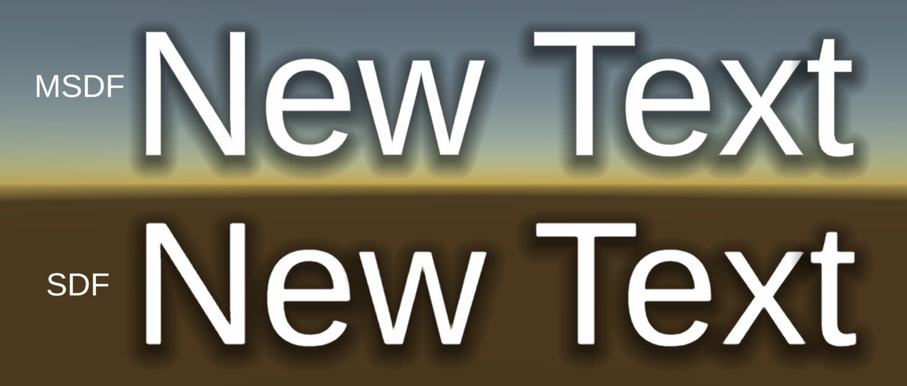
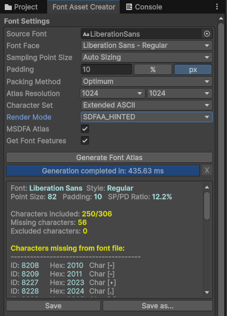
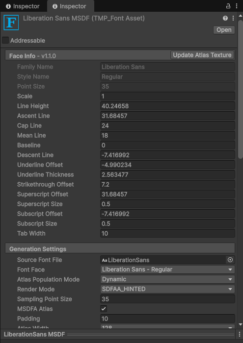
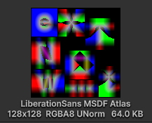
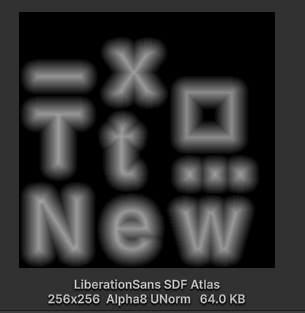

# TextMeshPro MSDFA
Proof-of-concept UPM package for TextMeshPro with MSDFA / MTSDF - rendering. MSDF in RGB-channels (for sharp angles) & SDF in alpha-channel (for soft effects)



# Built-in solution Request 
Please, UPVOTE built-in solution thread here: [Unity Discussions: TextMeshPro/TextCore MSDF request](https://discussions.unity.com/t/2026-could-textmeshpro-textcore-ever-support-multi-channel-signed-distance-fields/1730024)

# It is experimental
The package patches embedded `com.unity.ugui`, so pin Unity/UGUI versions and treat the API/serialized data as **unstable**

## Features
- `MSDFA Atlas` toggle in `Window > TextMeshPro > Font Asset Creator`
- `MSDFA Atlas` field in TMP Font Asset Inspector > `Generation Settings`
- RGBA32 distance-field atlas path and `TextMeshPro/MSDFA` shader
- Burst-backed glyph rendering for supported TrueType `glyf` outlines

## Screenshots









## Installation

Add the package from Git URL in Unity Package Manager:

```text
https://github.com/mitay-walle/com.mitay-walle.textmeshpro-msdfa.git#v0.1.0
```

Then execute menu item:

```text
Tools > TextMeshPro MSDFA > Embed UGUI And Apply Patch
```

### Attention
!!! Git CLI must be available in `PATH` !!!

The patcher embeds `com.unity.ugui`, applies `ugui-msdfa-package.patch`, and adds the `TMP_MSDFA_UGUI_PATCHED` define to TMP runtime/editor asmdefs. 

## Tests info

Verified with:

- Unity `6000.3.2f1` / Unity 6.3 LTS;
- Windows Editor;
- Android built target
- `com.unity.ugui` `2.0.0`, embedded and patched;
- no builds were made

## Memory & Performance

Atlas memory: MSDFA uses `TextureFormat.RGBA32`. Standard TMP SDF usually uses `Alpha8`, so atlas memory is about 4x higher at the same resolution, mipmaps off.

| Atlas | SDF `Alpha8` | MSDFA `RGBA32` |
| --- | ---: | ---: |
| 512x512 | 0.25 MiB | 1 MiB |
| 1024x1024 | 1 MiB | 4 MiB |
| 2048x2048 | 4 MiB | 16 MiB |

Font memory: this PoC also needs the original font bytes for contour extraction, so font-file memory can be roughly x2 before atlas and parsed-shape cache overhead. Example: `Arial Unicode` at 23 MB becomes about 46 MB when duplicated in memory.

Local stress result for glyph `V`, 1024x1024 atlas, 250 runs:

- MSDFA: `RGBA32`, `2.189 ms/run`;
- SDF: `Alpha8`, `0.521 ms/run`.

## Limitations

- PoC, not production-ready
- Patch compatibility depends on the tested `com.unity.ugui` source layout
- The outline parser targets TrueType `glyf`; other outline formats are out of scope for this package

## References
used algorythm author's repos:
- [Chlumsky/msdf-atlas-gen](https://github.com/Chlumsky/msdf-atlas-gen)
- [Chlumsky/msdfgen](https://github.com/Chlumsky/msdfgen)
